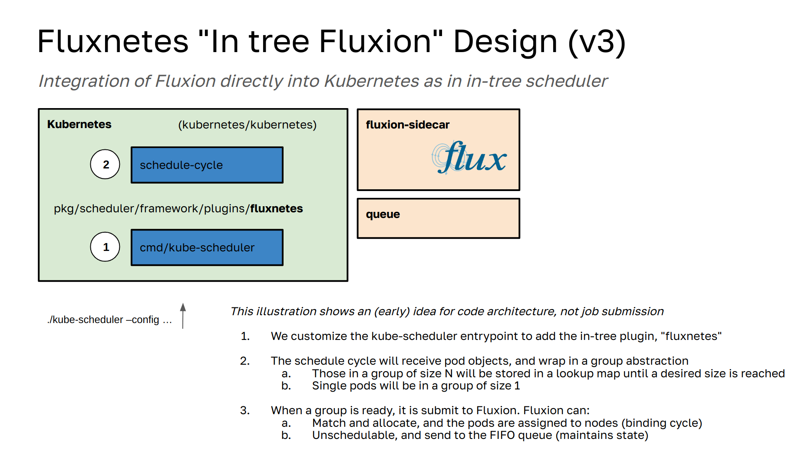

# Fluxnetes



Fluxnetes enables is a combination of Kubernetes and [Fluence](https://github.com/flux-framework/flux-k8s), both of which use the HPC-grade pod scheduling [Fluxion scheduler](https://github.com/flux-framework/flux-sched) to schedule pod groups to nodes. 

**Important** This is an experiment, and is under development. I will change this design a million times - it's how I tend to learn and work. I'll share updates when there is something to share. It deploys but does not work yet!

## Design

Fluxnetes builds two primary containers:

 - `ghcr.io/converged-computing/fluxnetes`: contains the core kube-scheduler, with fluxion added as an in-tree plugin, and the core scheduling logic changed to remove the single pod queue.
 - `ghcr.io/converged-computing/fluxnetes-sidecar`: provides the fluxion service, queue for pods and groups, and a second service that will expose a kubectl command for inspection of state.

The overall design is an experiment to blow up the internal "single pod" queue, and replace with using the fluxion (Flux Framework scheduler) instead. For this prototype, we will implement a queue service alongside Fluxion, and the main `schedule_one.go` logic will assemble groups (where a group can be a single pod) and then, upon reaching a minimum number of members, move to the official queue.

The current design reproduces what fluence does, however we use the default PodGroup abstraction provided by Coscheduling. 
This experiment will not be attempting to replace every functionality in the current Kubernetes ecosystem, but to provide a means to experiment with new ideas for scheduling.

## Deploy

Create a kind cluster. You need more than a control plane.

```bash
kind create cluster --config ./examples/kind-config.yaml
```

Install the certificate manager:

```bash
kubectl apply -f https://github.com/cert-manager/cert-manager/releases/download/v1.13.1/cert-manager.yaml
```

Then you can deploy as follows:

```bash
./hack/quick-build-kind.sh
```
You'll then have the fluxnetes service running, along with the scheduler plugins controller, which we
currently have to use PodGroup.

```bash
$ kubectl get pods
NAME                                            READY   STATUS    RESTARTS   AGE
fluxnetes-66575b59d8-ghx8h                      2/2     Running   0          8m53s
scheduler-plugins-controller-8676df7769-ss9kz   1/1     Running   0          8m53s
```

You can then create a job:

```bash
kubectl apply -f examples/job.yaml
```

which will create each of a PodGroup and the associated job, which will run:

```bash
$ kubectl logs job-n8sfg 
```
```console
potato
```

And complete.

```bash
$ kubectl get pods
NAME                                            READY   STATUS     RESTARTS   AGE
fluxnetes-66575b59d8-ghx8h                      2/2     Running    0          10m12s
job-n8sfg                                       0/1     Completed  0          33s
scheduler-plugins-controller-8676df7769-ss9kz   1/1     Running    0          10m12s
```

And that's it! This is fully working, but this only means that we are going to next work on the new design.
See [docs](docs) for notes on that.


## License

HPCIC DevTools is distributed under the terms of the MIT license.
All new contributions must be made under this license.

See [LICENSE](https://github.com/converged-computing/cloud-select/blob/main/LICENSE),
[COPYRIGHT](https://github.com/converged-computing/cloud-select/blob/main/COPYRIGHT), and
[NOTICE](https://github.com/converged-computing/cloud-select/blob/main/NOTICE) for details.

SPDX-License-Identifier: (MIT)

LLNL-CODE- 842614

### Fluence

The original fluence code (for which some partial is here) is covered under [LICENSE](.github/LICENSE.fluence):

SPDX-License-Identifier: Apache-2.0

LLNL-CODE-764420