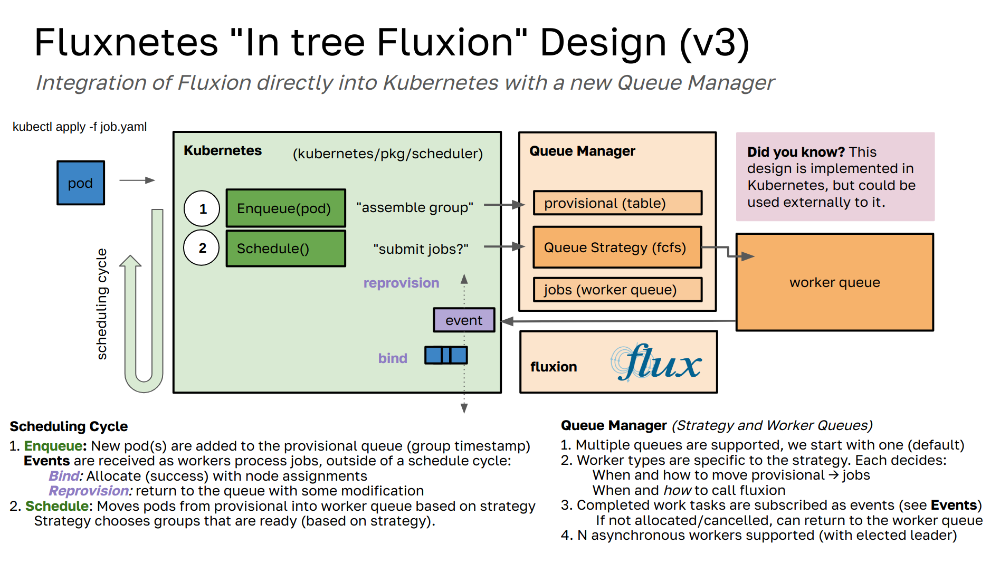

# Fluxnetes



Fluxnetes enables is a combination of Kubernetes and [Fluence](https://github.com/flux-framework/flux-k8s), both of which use the HPC-grade pod scheduling [Fluxion scheduler](https://github.com/flux-framework/flux-sched) to schedule pod groups to nodes. For our queue, we use [river](https://riverqueue.com/docs) backed by a Postgres database. The database is deployed alongside fluence and could be customized to use an operator instead.

**Important** This is an experiment, and is under development. I will change this design a million times - it's how I tend to learn and work. I'll share updates when there is something to share. It deploys but does not work yet!
See the [docs](docs) for some detail on design choices.

## Design

Fluxnetes builds three primary containers:

 - `ghcr.io/converged-computing/fluxnetes`: contains a custom kube-scheduler build with flux as the primary scheduler.
 - `ghcr.io/converged-computing/fluxnetes-sidecar`: provides the fluxion service, queue for pods and groups, and a second service that will expose a kubectl command for inspection of state.
 - `ghcr.io/converged-computing/fluxnetes-postgres`: holds the worker queue and provisional queue tables

The overall design is an experiment to blow up the internal "single pod" queue, and replace with using the fluxion (Flux Framework scheduler) instead. For this prototype, we will implement a queue service alongside Fluxion, and the main `schedule_one.go` logic interacts with this setup to assemble groups and submit them to the queue manager, ultimately to be run on the Kubernetes cluster. 

## Deploy

Create a kind cluster. You need more than a control plane.

```bash
kind create cluster --config ./examples/kind-config.yaml
```

Install the certificate manager:

```bash
kubectl apply -f https://github.com/cert-manager/cert-manager/releases/download/v1.13.1/cert-manager.yaml
```

Then you can deploy as follows:

```bash
./hack/quick-build-kind.sh
```
You'll then have the fluxnetes service running, a postgres database (for the job queue), along with the scheduler plugins controller, which we
currently have to use PodGroup.

```bash
$ kubectl get pods
NAME                                            READY   STATUS    RESTARTS   AGE
fluxnetes-6954cdcf64-gv7s7                      2/2     Running   0          87s
postgres-c8d55999c-t6dtt                        1/1     Running   0          87s
scheduler-plugins-controller-8676df7769-jvtwp   1/1     Running   0          87s
```

You can then create a job:

```bash
kubectl apply -f examples/job.yaml
```

which will create each of a PodGroup and the associated job, which will run:

```bash
$ kubectl logs job-n8sfg 
```
```console
potato
```

And complete.

```bash
$ kubectl get pods
NAME                                            READY   STATUS      RESTARTS      AGE
fluxnetes-7bbb588944-4bq6w                      1/2     Running     2 (20m ago)   21m
job-8xsqr                                       0/1     Completed   0             19m
postgres-597db46977-srnln                       1/1     Running     0             21m
scheduler-plugins-controller-8676df7769-wg5xl   1/1     Running     0             21m
```

You can also try submitting a bath of jobs:

```bash
kubectl apply -f examples/batch/
```
```console
kubectl get pods
NAME                                            READY   STATUS      RESTARTS      AGE
fluxnetes-7bbb588944-49skf                      1/2     Running     3 (58s ago)   81s
job1-k4v22                                      0/1     Completed   0             17s
job2-8bmf7                                      0/1     Completed   0             17s
job2-fmhrb                                      0/1     Completed   0             17s
job3-7gp4n                                      0/1     Completed   0             17s
job3-kfrt2                                      0/1     Completed   0             17s
postgres-597db46977-sl4cm                       1/1     Running     0             81s
scheduler-plugins-controller-8676df7769-zgzsj   1/1     Running     0             81s
```

And that's it! This is fully working, but this only means that we are going to next work on the new design.
See [docs](docs) for notes on that.

## Development

### Viewing Logs

You can view the scheduler logs as follows:

```bash
$ kubectl logs fluxnetes-7bbb588944-ss4jn -c scheduler
```

<details>

<summary>Fluxnetes Logs</summary>

```console
I0730 01:51:17.791122       1 serving.go:386] Generated self-signed cert in-memory
W0730 01:51:17.795420       1 client_config.go:659] Neither --kubeconfig nor --master was specified.  Using the inClusterConfig.  This might not work.
I0730 01:51:19.965133       1 server.go:154] "Starting Kubernetes Scheduler" version="v0.0.0-master+$Format:%H$"
I0730 01:51:19.965205       1 server.go:156] "Golang settings" GOGC="" GOMAXPROCS="" GOTRACEBACK=""
I0730 01:51:19.973277       1 secure_serving.go:213] Serving securely on [::]:10259
I0730 01:51:19.973402       1 requestheader_controller.go:172] Starting RequestHeaderAuthRequestController
I0730 01:51:19.973485       1 shared_informer.go:313] Waiting for caches to sync for RequestHeaderAuthRequestController
I0730 01:51:19.973702       1 tlsconfig.go:243] "Starting DynamicServingCertificateController"
I0730 01:51:19.975425       1 configmap_cafile_content.go:205] "Starting controller" name="client-ca::kube-system::extension-apiserver-authentication::client-ca-file"
I0730 01:51:19.975539       1 shared_informer.go:313] Waiting for caches to sync for client-ca::kube-system::extension-apiserver-authentication::client-ca-file
I0730 01:51:19.975596       1 configmap_cafile_content.go:205] "Starting controller" name="client-ca::kube-system::extension-apiserver-authentication::requestheader-client-ca-file"
I0730 01:51:19.975628       1 shared_informer.go:313] Waiting for caches to sync for client-ca::kube-system::extension-apiserver-authentication::requestheader-client-ca-file
I0730 01:51:20.073842       1 shared_informer.go:320] Caches are synced for RequestHeaderAuthRequestController
I0730 01:51:20.073943       1 scheduler.go:464] "[FLUXNETES]" Starting="queue"
I0730 01:51:20.075687       1 shared_informer.go:320] Caches are synced for client-ca::kube-system::extension-apiserver-authentication::client-ca-file
I0730 01:51:20.076874       1 shared_informer.go:320] Caches are synced for client-ca::kube-system::extension-apiserver-authentication::requestheader-client-ca-file
I0730 01:51:20.183696       1 client.go:773] "River client started" id="Fluxnetes" client_id="fluxnetes-7bbb588944-4bq6w_2024_07_30T01_51_20_074419"
I0730 01:51:25.184220       1 producer.go:541] "producer: Heartbeat" id="Fluxnetes" num_completed_jobs=0 num_jobs_running=0 queue="default"
I0730 01:51:30.184836       1 producer.go:541] "producer: Heartbeat" id="Fluxnetes" num_completed_jobs=0 num_jobs_running=0 queue="default"
...
I0730 01:52:10.183816       1 producer.go:541] "producer: Heartbeat" id="Fluxnetes" num_completed_jobs=0 num_jobs_running=0 queue="default"
I0730 01:52:13.277200       1 queue.go:131] Pod job-8xsqr has Group job (1) created at 2024-07-30 01:52:13 +0000 UTC
E0730 01:52:13.277836       1 provisional.go:58] Did not find pod job-8xsqr in group &{job %!s(int32=1) 2024-07-30 01:52:13 +0000 UTC} in table
I0730 01:52:13.286840       1 provisional.go:89] GROUP NAMES [job]
I0730 01:52:13.286890       1 provisional.go:112] GET select group_name, group_size, podspec from pods_provisional where group_name in ('job');
I0730 01:52:13.288115       1 provisional.go:98] DELETE delete from pods_provisional where group_name in ('job');
I0730 01:52:13.298948       1 queue.go:156] [Fluxnetes] Schedule inserted 1 jobs
I0730 01:52:13.334900       1 workers.go:54] [WORKER] JobStatus Running for group job
I0730 01:52:13.335322       1 resources.go:79] [Jobspec] Pod spec: CPU 1, memory 0, GPU 0, storage 0
I0730 01:52:13.335354       1 workers.go:67] Prepared pod jobspec id:"job"  container:"job"  cpu:1
I0730 01:52:13.349266       1 workers.go:96] Fluxion response %spodID:"job"  nodelist:{nodeID:"kind-worker"  tasks:1}  jobID:1
I0730 01:52:13.382286       1 workers.go:128] [Fluxnetes] nodes allocated kind-worker for flux job id 0
I0730 01:52:13.470426       1 scheduler.go:501] Got job with state completed and nodes: [kind-worker]
I0730 01:52:13.471628       1 scheduler.go:548] Pod {{ } {job-8xsqr job- default  79cb0091-beb0-4093-b97d-f473f4729efa 16335
...
I0730 01:52:15.184586       1 producer.go:541] "producer: Heartbeat" id="Fluxnetes" num_completed_jobs=1 num_jobs_running=0 queue="default"
```

</details>

### Debugging Postgres

It is often helpful to shell into the postgres container to see the database directly:

```bash
kubectl exec -it postgres-597db46977-9lb25 bash
psql -U postgres

# Connect to database 
\c

# list databases
\l

# show tables
\dt

# test a query
SELECT group_name, group_size from pods_provisional;
```

### TODO

- [ ] kubectl plugin to get fluxion state?
- [ ] Figure out how In-tree registry plugins (that are related to resources) should be run to inform fluxion
   - we likely want to move assume pod outside of that schedule function, or ensure pod passed matches.
- [ ] Optimize queries.
- [ ] Restarting with postgres shouldn't have crashloopbackoff when the database isn't ready yet
- [ ] The queue should inherit (and return) the start time (when the pod was first seen) "start" in scheduler.go
- Testing:
  - [ ] need to test duration / completion time works (run job with short duration, should be cancelled/cleaned up)
  - [ ] spam submission and test reservations (and cancel)
- [ ] implement other queue strategies (fcfs and backfill with > 1 reservation depth)
  - fcfs can work by only adding one job (first in provisional) to the worker queue at once, only when it's empty! lol.
- [ ] In cleanup do we need to handle [BlockOwnerDeletion](https://github.com/kubernetes/kubernetes/blob/dbc2b0a5c7acc349ea71a14e49913661eaf708d2/staging/src/k8s.io/apimachinery/pkg/apis/meta/v1/types.go#L319). I don't yet understand the cases under which this is used, but likely we want to delete the child object and allow the owner to do whatever is the default (create another pod, etc.)

Thinking:

- We can allow trying to schedule jobs in the future, although I'm not sure about that use case (add label to do this)
- What should we do if a pod is updated, and the group is removed?
- fluxion is deriving the nodes on its own, but we might get updated nodes from the scheduler. It might be good to think about how to use the fluxion-service container instead.
- more efficient to retrieve podspec from kubernetes instead of putting into database?

TODO:

- test job that has too many resources and won't pass (it should not make it to provisional or pending_queue)
  - can we do a satisfies first?
  - we probably need a unique on the insert...
- when that works, a pod that is completed / done needs to be removed from pending

## License

HPCIC DevTools is distributed under the terms of the MIT license.
All new contributions must be made under this license.

See [LICENSE](https://github.com/converged-computing/cloud-select/blob/main/LICENSE),
[COPYRIGHT](https://github.com/converged-computing/cloud-select/blob/main/COPYRIGHT), and
[NOTICE](https://github.com/converged-computing/cloud-select/blob/main/NOTICE) for details.

SPDX-License-Identifier: (MIT)

LLNL-CODE- 842614

### Fluence

The original fluence code (for which some partial is here) is covered under [LICENSE](.github/LICENSE.fluence):

SPDX-License-Identifier: Apache-2.0

LLNL-CODE-764420
