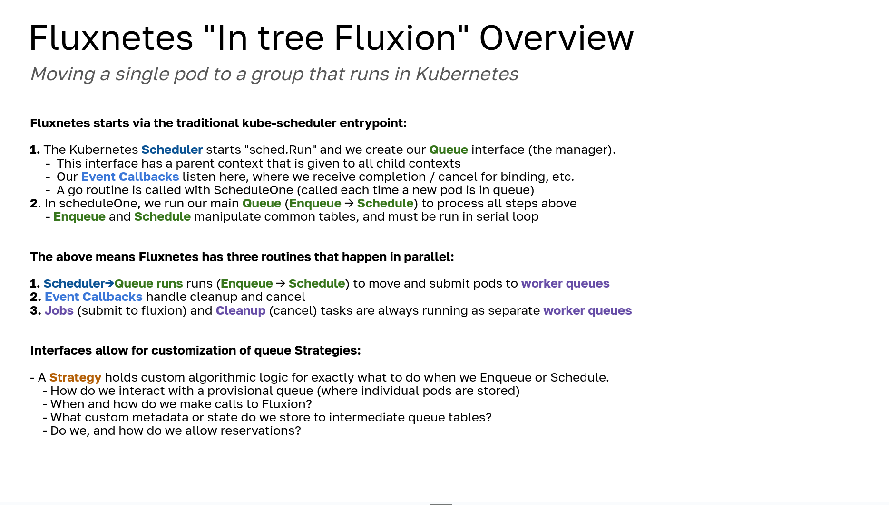
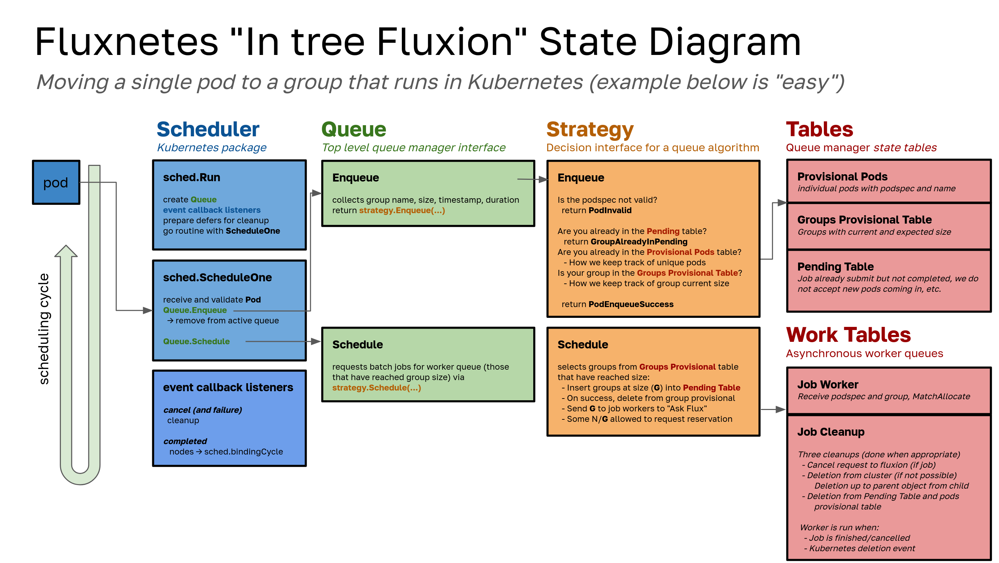

# Fluxnetes

## Usage

After install (see the [README](../README.md)) you can create any abstraction (pod or something with a pod template) that specifies the `schedulerName: fluxnetes` and has any of the following labels:

| Name | Description | Default |
|------|-------------|---------|
| "fluxnetes.group-name" | The name of the group | fluxnetes-group-<namespace>-<name> |
| "fluxnetes.group-size" | The size of the group | 1 |

As you might guess, if you specify `fluxnetes` as the scheduler but don't provide any of the above, the defaults are used. This means a single pod becomes a single member group. 

### Duration

Any pod object (or PodSpec template) can accept an `activeDeadlineSeconds` and this is how you should set your job time. Note that if you don't set this value, there will
be no duration (and the pod or object can run forever), which is needed for services, etc.

## Design

### How does it work?

This is the current design of Fluxnetes.


High level - we are deploying a custom entrypoint for the scheduler that doesn't add a plugin, but changes the Kubernetes core "Schedule" package to use Fluxion to schedule groups instead of single pods. We add a custom queue manager and ability to subscribe to events. More detail is provided in the sections below.

#### Entrypoint

We start with a custom scheduler plugin, however we are primarily using this as a trick to provide our own custom `kube-scheduler` entrypoint, which mimics the same [app](https://github.com/kubernetes/kubernetes/tree/master/cmd/kube-scheduler) as core Kubernetes, but we use our custom build of the core instead. You can find this in [kubernetes/cmd/kube-scheduler/](kubernetes/cmd/kube-scheduler/) and you'll notice that we technically do register Fluxnetes as a custom plugin. This is only done to provide a custom sort function that sorts pod by the same group name that will be collected (and assembled into groups) in the new Scheduler core. We also don't use the `kubernetes-sigs/scheduler-plugins` repository as a base to keep the number of dependencies at a minimum. Instead we maintain our own charts in `chart` (shown below).

#### Organization

The repository has the following organization:

```console
├── chart        # charts to deploy fluxnetes
├── docs         # you are here!
├── hack         # helpers for deployment
├── kubernetes   # charts to deploy fluxnetes
├── src          # deployment source code for fluxion sidecar
└── upstreams    # cloned kubernetes
```

The codebase here is designed to be updated - the files that we have changed (in `kubernetes` under equivalent paths) are moved into an upstream clone at build time. We move them to be under `pkg/scheduler/framework/plugins` since that is where other in-tree plugins live, but Fluxnetes (the name of the package being `fluxnetes` is anything but that). Most of our changed code is in the `scheduler.go` and `schedule_one.go` files, and then the entire custom logic is added newly. This is a strategy to (hopefully) help with future updates, which we will be able to do via a combination of automation with testing and pull requests with new Kubernetes releases.

#### Containers

Fluxnetes had the challenge of needing to add state. The scheduler-plugins "Coscheduling" plugin used the strategy of a PodGroup, but I decided to take (what I deemed to be) a more straight-forward approach, adding an actual database to back the queues. This meant adding a postgres container. The entire set of containers are as follows:

 - `ghcr.io/converged-computing/fluxnetes`: contains a custom kube-scheduler build with flux as the primary scheduler.
 - `ghcr.io/converged-computing/fluxnetes-sidecar`: provides the fluxion service, queue for pods and groups, and a second service that will expose a kubectl command for inspection of state.
 - `ghcr.io/converged-computing/fluxnetes-postgres`: holds the worker queue and provisional queue tables

We deploy one pod for postgres, and one pod that ombines the fluxnetes and its sidecar. The third pod we deploy is the scheduler plugins controller, which might be possible to remove but I haven't tested that yet.

#### Queues

As you can see in the picture, there is a Queue Manager. The Queue manager is started on "boot," meaning that it (and its client and) subscribed events) persist throughout the life of the plugin (Kubernetes) running. The queue manager owns a client that can have one or more worker types. We currently have just one Queue Strategy - a "first come first serve with backfill" sort of deal. There are several steps required to get this working, because as you might know, Kubernetes starts with a queue of single pods!

1. We receive single pods (after being sorted by the Fluxnetes plugin) according to group name and time created.
2. We add them to a provisional table, where we also save that information along with size.
 - a single pod is a group of size 1
 - this provisional table will be kept until the group is entirely completed, as we use it to get podspecs
3. For each run of the Kubernetes `ScheduleOne` function (meaning we receive a new pod) we:
 - Enqueue
   - add to the pod provisional table and (if not known) the group provisional table, which holds a count
 - Schedule
   - check the table for pod groups that have reached the desired size
   - submit the jobs to the worker queue that have, and remove from the provisional table
4. Once in the worker queue, they are ordered by Priority and scheduledAt time.
5. The worker function does a call to fluxion `MatchAllocateElseReserve` (up to some reservation depth)
 - A reservation is put back into the queue - it will be run again!
 - The reservation can be saved somewhere to inform the user (some future kubectl plugin)
 - we can also ask the worker to run its "work" function in the future, either at onset or some event in the run
6. Events are received back in the main Schedule->Run function
 - A successfully completed job with nodes is an allocation. We take the list of nodes and pod names and bind them all at once.
 - A cancelled job is cleaned up. This means something happened that we deemed it unschedulable / unsatisfiable
 - A group that has not yet been allocated or run won't show up here!
7. For both cancelled and completed, we perform cleanup
 - The Fluxion Job ID is cancelled, if we have one
 - The pod is deleted  (terminated) and we walk up to the root object (e.g., Job) to delete the rest
 - The pod is removed from the pods provisional table, and the group from pending
   - This opens up the group name and namespace (unique identifiers) to accept new groups

For jobs with durations set that don't finish in time, a cleanup job is submit that will trigger at the time to run the same cleanup function above. If pods / groups finish early, a deletion event is triggered that does the same.  We currently don't elegantly handle the scheduleCycle and bindingCycle call (in that we might want to give metadata to fluxion that goes into them). This needs to be done!

#### Queue Strategies

Each queue strategy consists of:

 - A number of N queues, each of which can have one or more worker types. Each worker type can have a custom function associated.
 - A provisional queue, again that can be customized to move pods based on the strategy.

| Strategy | Description | Implemented? |
|----------|-------------|--------------|
| easy     | backfill with time-ordered priority only considering the first job's reservation (thanks to [@trws](https://github.com/trws) for the description!) | Yes |
| fcfs     | first come first serve | Not yet |


> Easy

The easy strategy is "backfill with time-ordered priority only considering the first job's reservation." This means that one reservation is done per scheduling cycle.
We will eventually have other strategies that allow for more reservations. This strategy has two queues, and one worker type for each:

- **Default** "workers queue" (is what I call it) is what handles asking fluxion for allocations. This is the main queue.
- **Cleanup** "cancel queue" is what handles canceling reservations, and when pods are cancelled (to be implemented) it will handle that as well. It's a different queue (and different workers) so the jobs do not collide.

#### State Diagram

The following overview and diagrams describe the above components and show basic states.






## Notes

> July 29, 2024

Today we are merging in the "gut out and refactor" branch that does the following:

 - Add Queue Manager (and queues design, shown and described below) 
 - Remove what remains of Fluence (now Fluxnetes is just a shell to provide sort)
 - Replace the default scheduler (schedulingCycle) with this approach (we still use bindingCycle)

The new queue design is based on a producer consumer model in that there are  workers (the number of our choosing) each associated with different queues. The workers themselves can do different things, and this depends on both the queue and Queuing strategy (I say this because two different strategies can share a common worker design). Before we hit a worker queue, we have a provisional queue step. This means that:

1. Incoming pods are added to a provisional table with their name, group, timestamp, and expected size.
2. Pods are moved from the provisional table to the worker queue when they reach quorum (the minimum size)
3. At this point, they go into the hands of a Queue Manager, ordered by their group timestamp.

For the first that I've added, which I'm calling FCFS with backfill, the worker task does a call to fluxion, specifically a `MatchAllocate`. I am planning to change this to a `MatchAllocateElseReserve` so I can "snooze" the job to trigger again in the future given that it cannot be scheduled then and there. When the work is allocated, the metadata for the job (specifically args for "Nodes") is updated to carry the nodes forward to events that are listening for them. A subscription event is sent back to the main scheduler, which receives the nodes, and then performs binding. The pods are received as a group, meaning the binding of the group happens at the same time (in a loop, still one by one, but guaranteed to be in that order I think) and the work is run. Some (high level) work that still needs to be done:

- The provisional queue hardened up to be provided (and exposed) as explicit interfaces (it is part of the main fluxnetes queue module now)
- A pod label for an expected time (and a default time) could be used so every job has an expected end time (for Fluxion). A cancel queue would handle this.
- The in-tree plugin outputs (needs for volumes, and what nodes can provide) needs to be exposed to Fluxion. Either fluxion can be told:
  - "These nodes aren't possible for this work"
  - "These are the only nodes you can consider for this work"
  - "Here is a resource requirement you know about in your graph"

There are more features that still need to be worked on and added (see the README.md of this repository) but this is a good start! One thing I am tickled by is that this does not need to be Kubernetes specific. It happens to be implemented within it, but the only detail that is relevant to Kubernetes is having a pod derive the underlying unit of work. All of the logic could be moved outside of it, with some other unit of work.


> July 10th, 2024

Fluxnetes is functioning, on equal par with what fluence does to schedule and cancel pods. The difference is that I removed the webhook and controller to create PodGroup, and (for the time being) am relying on the user to create them. The reason is because I don't want to add the complexity of a new controller and webhook to Kubernetes. And instead of doing a custom CR (custom resource) for our PodGroup, I am using the one from coscheduling. THis allows install of the module without breaking smaller level dependencies. I'm not sure why that works, but it does!

So the current state is that Fluxnetes is scheduling! My next step is to slowly add components for the new design, ensuring I don't break anything as I go, and going as far with that approach as I can until I need to swap it in. Then I'll likely need to be a bit more destructive and careful.

> This was a group update on July 8th, 2024

An update on design thinking for what I'm calling "fluxnetes" - a next step experiment for Kubernetes and Fluxion integration. Apologies in advance this is long - I do a lot of thinking and have desire to express it, because I don't think the design process (our thinking!) is always shared transparently. To start, there are two strategies to take:
Out of tree plugins (scheduler-plugins, fluence is an example) have the benefit of being more acceptable in the Kubernetes community - you define a few endpoints and use their template. That said, we've still had issues customizing it (and the build to integrate the upstream anything but simple).

- In tree plugins: are in [pkg/scheduler/framework/plugins](https://github.com/kubernetes/kubernetes/tree/master/pkg/scheduler/framework/plugins).
- A combination of the two, often to build a custom scheduler plugin with tiny changes to core kubernetes.
- I've been flipping back and forth between different designs for a few weeks, and have finally settled on at least an approach to start. 

I'm not sure it will work, but I have good reasons, and will outline here. :thread:

I first thought I was going to do a combination - an out of tree plugin with tiny changes to kube-scheduler via a custom build that had a few files copied over (this is how I did the scheduler sniffer). The insight here is that a scheduler-plugins custom-scheduler is just building a customized kube-scheduler entrypoint, albeit differently. For small changes, that works really well. For larger changes, or adding entirely new stuff (and modules) it gets tricky, because you have to add new modules, tidy, and when you consider the entire Kubernetes code base plus the staging/src directory, version conflicts are almost unavoidable. :upside_down_face: 

Since each of core kubernetes and the scheduler-plugins build to the same entrypoint, you have to make a design decision about which to template and build (and which to use as a dependency or get rid of entirely). It's like baking cake into your pie (and the cake, kubernetes core, is largely already baked), or pie batter into your cake batter (and you get to bake both of them). Or, if you integrate the functionality of your custom plugin, you are just baking one cake. Side note... mmmm cake. :cake:

The insight that had me move toward an in tree design (bake one cake) was realizing that because the schedule_one.go (and general flow of using plugins within Kubernetes itself) was flawed for what we want to do, we'd have to change it no matter what. I needed to bake that cake no matter what. I was either going to (still) try to make a separate pie, or make a new cake recipe.

What design changes am I talking about? The single pod queue one. I really want to try eliminating it - the design does not allow easily for scheduling groups. On the other hand, we can call a single pod a one member group. A group might be scheduled, move external to Kubernetes (some queue service), and then that activeQ not needed, especially to iterate over into infinitude. The out of tree approach doesn't work because even if we could sneak the functionality into custom endpoints, at the end of the day we need to cut into that default cycle (scheduling and binding).

I think I'd like to try some kind of custom queue that holds groups. Fluxion can't do this - it can just allocate or reserve, and the reservations are reset/updated on different events like cancel. Ideally we could have a fluxion-service that includes a queue alongside it. When something cannot be allocated, it is queued. When a cancel is run, the next in the queue is ready. We should talk about what strategies we can use to add a separate queue service, whether it be alongside fluxion (in the same container) or a separate one.

Now to talk about building in tree, and feel free to skip these sections if you don't care for development details. I was really not wanting to edit the core go.mod of Kubernetes - that's asking for things to break. So one trick I learned is that for "new stuff" you can get away with a lot by adding to src/staging, because you can define a separate go.mod there. The trick is adding your new path dynamically to go.mod at the root, and then you need to run `go work vendor`. If you run a tidy, you are again going to be updating versions and probably break something. I got very close to this design working today, but ultimately came down to an issue with a [changed interface](https://github.com/kubernetes/apimachinery/commit/126f5cee563da8f0b090df60ca8738d16b5188bf) in controller-runtime, which was brought in somewhere else. Downgrading Kubernetes to an older version broke other things, and (generally speaking) as we've learned with fluence it's dangerous to fall behind Kubernetes. I stepped back and decided it was not a good design.

I then noticed the total absence of controller-runtime in the Kubernetes code base, period! But yet, they still have webhooks and controllers! In retrospect it's probably obvious - controller-runtime is made for creating external controllers. I think it was a layer of abstraction to make the developer life easier, but they don't use it in core. If we compare design between the two, the strategies are totally different (albeit plugin overall architecture is comparable). I wasn't going to be the toon that stupidly tried to force in a new module that obviously was not intended for that use case. :clown_face:

This means that for our current design with fluence (a webhook and controller) I'll need to refactor them for this different design, and learn how it's done in Kubernetes proper. That seems reasonable, and I will learn something too. That said, I'm hoping I can figure out a design that either minimize or removes the need for a custom controller and webhook. For example, the activeQ in Kubernetes doesn't need a CRD, it's a special kind of [heap](https://github.com/kubernetes/kubernetes/blob/3125877de0aefbb642833beaa3a4c189d833e797/pkg/scheduler/internal/heap/heap.go#L127) that can be cached and [dumped](https://github.com/kubernetes/kubernetes/blob/3125877de0aefbb642833beaa3a4c189d833e797/pkg/scheduler/scheduler.go#L351-L353). I'm hoping we can do the same with some representation of a group.

To summarize, after weeks of testing (and lots of thinking) what I have is a development environment where I'm building the kube-scheduler entrypoint with customized schedule*.go, and fluence added as an in-tree plugin. You can see the changes so far [here](https://github.com/flux-framework/flux-k8s/compare/add-fluxion-service?expand=1) - this is the minimum reorganization to get it to build. This is just the start of work - a blank slate for (finally) developing. I can (finally) do that soon! It's like deciding to build a house, and then you take 4 months to dig a really big hole for the basement, and then get back to your house design... :hole:

Finally, this is all for learning / experimenting, and I haven't convinced myself yet that the approaches that are emerging from the community to support gang scheduling (think Kueue / Volcano) are not good enough. I do think it's OK we try for an in-tree "more destructive" approach because I think we are less concerned with some final contribution to Kubernetes, and more concerned with testing new ideas for scheduling. That said, I don't think we've demonstrated with the latest tools (the ones stated above) there is anything problematic, and we need to do that. We need to do some set of experiments that demonstrate what is not good enough for current gang scheduling designs.

All that said, I do believe diving into a code base and trying to understand and change it is immensely valuable for learning, and I'd want to do it only for that. And it's stupid fun! I've been slower to work on it because I'm also really interested in eBPF at the moment too. I guess that's a good problem to have :stuck_out_tongue: